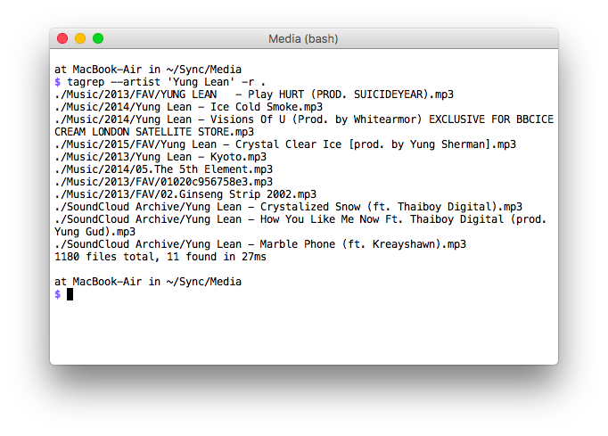

# tagrep



tagrep is a tiny CLI utlity for finding tracks with the given ID3 frames
(e.g. artist, title or year).

## Installation

    go get -u github.com/bogem/tagrep

## Usage

```
$ tagrep -h
Usage:
  tagrep [flags] paths

Flags:
      --abs             print absolute paths
      --artist string   match artist
      --ignore-case     print absolute paths
  -r, --recursive       recursive search
      --title string    match title
  -v, --verbose         verbose output
      --year string     match year
```

## Example of Usage

```
$ tagrep --artist 'Yung Lean' -r .
./Music/2015/FAV/Yung Lean — Crystal Clear Ice [prod. by Yung Sherman].mp3
./Music/2014/05.The 5th Element.mp3
./SoundCloud Archive/Yung Lean — Crystalized Snow (ft. Thaiboy Digital).mp3
./SoundCloud Archive/Yung Lean — How You Like Me Now Ft. Thaiboy Digital (prod. Yung Gud).mp3
./SoundCloud Archive/Yung Lean — Marble Phone (ft. Kreayshawn).mp3
./Music/2014/Yung Lean - Ice Cold Smoke.mp3
./Music/2014/Yung Lean — Visions Of U (Prod. by Whitearmor) EXCLUSIVE FOR BBCICECREAM LONDON SATELLITE STORE.mp3
./Music/2013/FAV/YUNG LEAN   - Play HURT (PROD. SUICIDEYEAR).mp3
./Music/2013/FAV/01020c956758e3.mp3
./Music/2013/Yung Lean - Kyoto.mp3
./Music/2013/FAV/02.Ginseng Strip 2002.mp3
1180 files total, 11 found in 62ms
```
